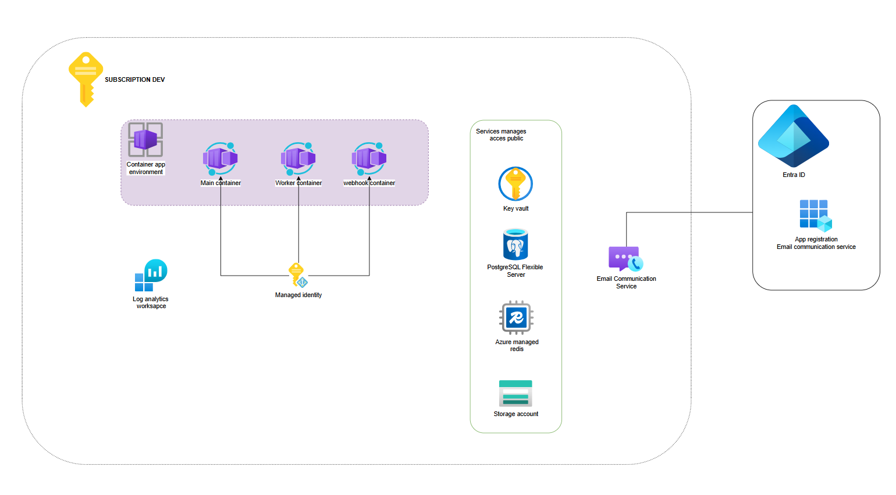

# n8n on Azure Container Apps — proof of concept

n8n in **queue mode** (`main` + `worker`) on Azure Container Apps, with PostgreSQL Flexible Server,
Azure Managed Redis, Key Vault, Log Analytics and Azure Communication Services for emails, deployed
with Terraform. The worker is autoscaled by KEDA on the depth of the Redis queue.
[Azure Verified Modules](https://azure.github.io/Azure-Verified-Modules/) are used wherever one
exists, except for Redis ([why](#why-redis-is-a-native-resource)).

> [!WARNING]
> **Publicly exposed, not production-ready.** The editor, API and webhooks are on the public
> Internet. PostgreSQL, Redis and Key Vault have public endpoints, and PostgreSQL's firewall
> includes the `0.0.0.0` "Allow Azure services" rule, which admits *any* Azure-hosted resource,
> including other tenants'. No VNet, WAF, alerting or CI/CD; local Terraform state. Deploy in a
> sandbox subscription and destroy it when you are done.

## Architecture



A single subscription: the Container Apps environment running the n8n containers, with PostgreSQL,
Redis, Key Vault and Storage reached over their public endpoints, a managed identity for the
containers, Log Analytics, and emails sent through Communication Services with an Entra ID app
registration for the SMTP credentials.

The production design is a different shape — hub and workload subscriptions, Application Gateway
WAF v2 as the only entry point, private endpoints and private DNS zones instead of public ones,
Bastion for administrative access, a container registry and a backup vault:
[target architecture](docs/private.png).

## Prerequisites

- A sandbox Azure subscription with permission to create role assignments (Owner, or Contributor +
  User Access Administrator).
- Permission to register Entra ID applications, for the SMTP credentials.
- [Azure CLI](https://learn.microsoft.com/cli/azure/install-azure-cli) (`az login`),
  [Terraform](https://developer.hashicorp.com/terraform/install) `~> 1.11`, and a bash shell.

## Cost

Azure retail prices for France Central (September 2026), before tax.

| Resource | ~ / month |
|---|---|
| Container Apps — `main` 1 vCPU / 2 GiB, 24/7 (idle to active rate) | 20-90 EUR |
| Azure Managed Redis `Balanced_B0`, without high availability | ~12 EUR |
| PostgreSQL `B_Standard_B1ms` + 32 GB | 15-20 EUR |
| Worker (0 replicas when idle), Key Vault, Log Analytics | < 5 EUR |
| Communication Services Email, billed per email | < 1 EUR |
| **Total if left running** | **~50-130 EUR** |

Under 1 EUR if destroyed the same day.

## Deploy

```bash
az account set --subscription "<sandbox subscription>"
# Read by both azurerm and azapi, so that they target the same subscription
export ARM_SUBSCRIPTION_ID=$(az account show --query id -o tsv)

for ns in Microsoft.App Microsoft.Cache Microsoft.DBforPostgreSQL Microsoft.OperationalInsights \
          Microsoft.KeyVault Microsoft.ManagedIdentity Microsoft.Communication; do
  az provider register --namespace "$ns"
done

cd terraform
terraform init
terraform plan -out main.tfplan
terraform apply main.tfplan   # 15-20 minutes
```

Tear it down with `terraform destroy`.

## Configuration

Read [terraform/locals.tf](terraform/locals.tf). Every setting lives there — region, sizing, n8n
image and tuning — with no variables and no `tfvars`. Values produced by resources (hostnames, n8n
environment variables, Key Vault references) sit next to the modules that use them, e.g.
[terraform/container_apps.tf](terraform/container_apps.tf).

Resource names follow `<type>-<workload>-<environment>-<location_short>-<instance>`. Globally unique
names (Key Vault, PostgreSQL, Redis) end with 5 characters derived from the subscription ID instead
of the instance, so they do not collide across subscriptions and stay stable between runs.

## Validate

```bash
terraform output -raw n8n_url    # open it and create the owner account
```

Create a workflow with a Webhook trigger, activate it and `curl` its production URL. Then check that
the **worker**, not the main, ran it — that is *the* queue mode test:

```bash
RG=$(terraform output -raw resource_group_name)
MAIN=$(terraform output -raw container_app_main_name)
WORKER=$(terraform output -raw container_app_worker_name)

az containerapp logs show -n "$WORKER" -g "$RG" --follow
```

KEDA knows nothing about n8n: it reads the length of a Redis list. If `listName` in
[terraform/container_apps.tf](terraform/container_apps.tf) does not match the actual BullMQ list, the
worker never scales out, silently. List the real keys:

```bash
az containerapp exec -n "$MAIN" -g "$RG" \
  --command "sh -c 'apk add --no-cache redis >/dev/null 2>&1; redis-cli -h \$QUEUE_BULL_REDIS_HOST -p \$QUEUE_BULL_REDIS_PORT -a \$QUEUE_BULL_REDIS_PASSWORD --tls --no-auth-warning KEYS \"*\"'"
```

### PostgreSQL

The firewall allows the public IP of the machine that ran `terraform apply`; re-apply if yours
changed. With the admin login, whose password is in Key Vault:

```bash
PGPASSWORD=$(az keyvault secret show --vault-name "$(terraform output -raw key_vault_name)" \
  --name n8n-db-password --query value -o tsv) \
  psql "host=$(terraform output -raw postgresql_fqdn) dbname=n8n user=pgadmin sslmode=require"
```

With the Entra ID administrator, if `postgresql.entra_admin` is set:

```bash
PGPASSWORD=$(az account get-access-token --resource-type oss-rdbms --query accessToken -o tsv) \
  psql "host=$(terraform output -raw postgresql_fqdn) dbname=n8n user=<principal_name> sslmode=require"
```

### Email

Invite a user from *Settings > Users*. The sender is the Azure managed domain
(`terraform output -raw email_sender`), capped at **5 emails per minute and 10 per hour** per
subscription — a quota that cannot be raised. If nothing arrives, check that the Communication
Service's SMTP username is *Ready to use* in the portal, then read the main's logs.

## Why Redis is a native resource

- **n8n needs `NoCluster`.** Its queue is BullMQ, which drives jobs through atomic multi-key Lua
  scripts (`...:wait`, `...:active`, `...:completed` together). A clustered Redis spreads keys over
  16,384 hash slots and rejects cross-slot multi-key commands with `CROSSSLOT`. The Azure Managed
  Redis default is `OSSCluster`.
- **The AVM module `Azure/avm-res-cache-redisenterprise` (0.2.0) rejects `NoCluster`** in its own
  input validation, and exposes neither `access_keys_authentication_enabled` nor the access key.
- **n8n can only authenticate with a password.** `access_keys_authentication_enabled` defaults to
  `false`, and the primary key is only exported when it is `true`.
- **`NoEviction`** instead of the default `VolatileLRU`: a job broker must never evict jobs.
- Azure Managed Redis listens on **port 10000 with TLS**, whereas n8n defaults to 6379 in clear
  text, hence `QUEUE_BULL_REDIS_PORT` and `QUEUE_BULL_REDIS_TLS`.
